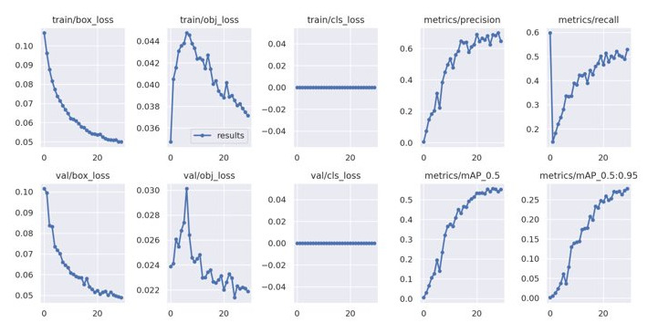

# **Mushroom Classification**
Hello and welcome to my mushroom classification project. This was my final project for the Data Science Bootcamp at Lighthouse Labs. I have been fascinated by our little fungal friends for many years now. The sheer diversity and reproductive strategies is simply staggering... some mushrooms have 20 000+ mating types! I have a BSc in Microbiology and was very close to doing a genetic study but chose identification last minute to make sure I did not lose anyone during my presentation. The popularity of mushrooms is increasing, and so are poisonings. Accurately identifying mushrooms would eliminate accidental poisonings.

## **Table of Contents**
1. [__Overview__](https://github.com/Graham-Broughton/mushroom_classification#Overview)
2. [__Obtaining Images__](https://github.com/Graham-Broughton/mushroom_classification#Images)
3. [__YOLOv5__](https://github.com/Graham-Broughton/mushroom_classification#YOLOv5)

## **Overview**
I explored this subject on two levels: 
- A binary identification model specifically for morels and false morels (_Morchella_ and _Gyromitra_ sp.).
- A model to identify all species I had labeled images of with at least 100 photos of each species. (~700 species and 15 000 images)

Reasons I chose morels/false morels:
* Very popular with novices
* False morels are poisonous, they contain jet fuel (hydrazine)
* Not economically viable to grow in Western countries 

The second model was to challenge myself and to see how far you can push Google Colab's TPUs. I also chose to do the whole project completely in the cloud using Google Cloud Products to gain experience using their products and to be able to use the TPU.

After sourcing my images I chose to do a 2-step classification process using YOLOv5 to identify and crop mushrooms in the image, then run the cropped image through a CNN (EffecientNetv2L) for the final classification.

## **Images**
Three sources were used for the primary training and one source to train the YOLOv5 network.
* [Inaturalist Open Database](https://forum.inaturalist.org/t/getting-the-inaturalist-aws-open-data-metadata-files-and-working-with-them-in-a-database/22135) 
    * ~1500 of each
    * PostgreSQL was used to select for research grade quality _Morchella_ or _Gyromitra_
* [Mushroom Observer](https://mushroomobserver.org/articles/20)
    * ~1500 of each
    * Used pandas to filter their csv for the mushrooms of interest, then regex to alter the URL to a higher quality link
* [2018 FGCVx Fungi Classification Challenge](https://github.com/visipedia/fgvcx_fungi_comp#data)
    * ~90000 images containing 1400 species
    * These data were used only for the general classification approach. Pandas was used to manipulate and merge the various csv's present into a workable database
* YOLOv5 training: [Open Images v6](https://storage.googleapis.com/openimages/web/visualizer/index.html?set=train&type=segmentation&r=false&c=%2Fm%2F052sf)
    * ~1700 labeled images
    * [Fiftyone](https://voxel51.com/docs/fiftyone/) was used to download the subsection of Open Images V6 that had the label "Mushroom"

## __YOLOv5__
As previously stated, YOLOv5 is a neural network for object detection: given an image it places a boudning box around any objects it identifies for a chosen label. I thought it would improve my model on two fronts. The first, 
* some photos were not even of mushrooms but spores instead. 
* 'standardizing' the images should improve accuracy by having the mushroom in a similar area of the image.

Training this network required images with labeled bounding box coordinates. I used OpenImagesV6 which had ~1700 labeled mushrooms images. Here are the results of the training:

As you can see, I could have trained it for another 5-10 epochs but unfortunately time was running out.

## __CNN__
